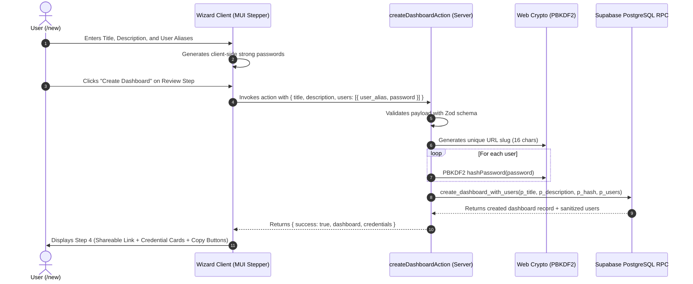

# Research: Dashboard Creation Wizard Implementation

**Date**: 2026-08-24T20:00:00Z  
**Researcher**: Antigravity  
**Git Commit**: 6dff261235a6a0635f307cdf8f5841338f4fab97  
**Branch**: feature/s-01  
**Repository**: palucdev/scytala  

## Research Question

Analyze and design the implementation of the **Dashboard Creation Wizard** (`S-01`, route `/new`) for Scytala.
- Explore state-of-the-art (SOTA) multi-step creation wizard patterns in React 19, Next.js App Router, and Material-UI (MUI).
- Inspect existing database entities, RPC functions, and repository methods in `src/client/db-client.ts` and `src/lib/supabase.ts`.
- Design the Next.js Server Action (`src/actions/dashboard.ts`) bound to the wizard.
- Review and apply library documentation for React 19, Next.js, and MUI (via `ctx7` and Exa).

---

## Summary

The **Dashboard Creation Wizard** is the primary entry point (`/new`) for creating isolated, self-contained Scytala dashboards with per-dashboard credentials without global account registration.

### Key Findings:
1. **Frontend Architecture & UX (React 19 + Next.js App Router + MUI):**
   - Modern App Router wizards use a client-side multi-step state machine with `@mui/material/Stepper` (horizontal on desktop, vertical/compact on mobile) combined with React 19 hooks (`useActionState` / `useTransition`).
   - The wizard cleanly separates into 4 distinct steps:
     1. **Dashboard Details:** Title (required) and Description (optional).
     2. **Participant Credentials:** Dynamic list of participant user aliases with auto-generated strong passwords (`generateRandomPassword()`).
     3. **Review & Confirmation:** Read-only summary before atomic server creation.
     4. **Creation Success & Credentials Distribution:** One-time reveal of shareable dashboard link (`/dashboard/<hash>`) and cleartext credentials with one-click copy utilities before redirecting into the dashboard.
2. **Database Entities & RPC Integration:**
   - Database schema and atomic PostgreSQL RPC functions were established in `F-01` (`supabase/migrations/20260819000000_create_dashboard_schema.sql` and `supabase/migrations/20260820000000_create_dashboard_rpcs.sql`).
   - The method `DatabaseClient.createDashboard(input: CreateDashboardInput)` in `src/client/db-client.ts` and `src/lib/supabase.ts` executes the atomic RPC `create_dashboard_with_users(p_title, p_description, p_hash, p_users)`.
3. **Next.js Server Actions & Security Pipeline:**
   - A dedicated server action `createDashboardAction` in `src/actions/dashboard.ts` acts as the secure boundary between client inputs and database execution.
   - The action executes a 4-stage pipeline: **Schema Validation (Zod)** $\rightarrow$ **URL Slug Generation** (`generateDashboardSlug()`) $\rightarrow$ **Server-side PBKDF2 Password Hashing** (`hashPassword()` on every participant password) $\rightarrow$ **Atomic Database Persistence** (`db.createDashboard()`).
   - Cleartext passwords never touch database storage, but are returned once to the calling client for immediate out-of-band distribution to collaborators.
4. **Design & Theming:**
   - Full alignment with `PapyrusThemeLight` (`src/theme/papyrus-theme-light.ts`) using custom serif typography (`IM Fell English`, `Crimson Text`), papyrus palette colors (`#713813`, `#efe0c4`, `#f5ead0`), and strict exclusion of TailwindCSS.
5. **Quality Gates & Test Coverage:**
   - All components, helper validation schemas, and server actions must maintain $\ge 80\%$ test coverage across statements, branches, functions, and lines via Vitest + `happy-dom`.

---

## Detailed Findings

### 1. State of the Art (SOTA) Multi-Step Creation Wizard Architecture

Research across modern Next.js 16 and React 19 applications reveals two prevailing architectural patterns for multi-step wizards:

| Pattern | Mechanism | Best Use Case | Fit for Scytala |
|---|---|---|---|
| **Multi-Route URL State** | Each step has its own URL route (`/new/step-1`, `/new/step-2`) with intermediate state stored in cookies or drafts. | Long enterprise onboarding flows (>5 pages) requiring browser back/forward URL bookmarking. | ❌ Excessive complexity for a 3-step creation form; storing sensitive unhashed participant passwords in intermediate session cookies creates security risks. |
| **Composite Client State Machine + Server Action Finalizer** | Single route (`/new`) orchestrating step state via React client state, validating step by step, and executing an atomic Server Action on final confirmation. | Focused creation workflows (3–4 steps) with immediate credential generation and one-time secret display. | ✅ **Recommended**: Keeps passwords in client memory during configuration, performs atomic server submission, and provides immediate copy-and-distribute UI. |

#### React 19 `useActionState` and Form Submission Pattern:
In React 19, `useActionState` simplifies managing form pending states and structured responses:
```tsx
const [state, formAction, isPending] = useActionState(createDashboardAction, initialActionState);
```
- Action returns a typed discriminated union:
  - `{ success: true, dashboard: Dashboard, credentials: ParticipantCredential[] }`
  - `{ success: false, error: string, fieldErrors?: Record<string, string[]> }`

---

### 2. Database Entities, RPCs, and Repository Methods

The foundational change `F-01` established the relational model and repository contracts:

#### Existing Domain Types (`src/client/db-client.ts:39-93`):
```typescript
export interface Dashboard {
  id: string;
  hash: string;
  title: string;
  description: string | null;
  created_at: string;
  updated_at: string;
}

export interface DashboardUser {
  id: string;
  dashboard_id: string;
  user_alias: string;
  password_hash: string;
  created_at: string;
}

export interface CreateDashboardInput {
  title: string;
  description?: string | null;
  hash?: string;
  users: Array<{
    user_alias: string;
    password_hash: string;
  }>;
}
```

#### Database Client Port & Adapter (`src/client/db-client.ts:143-146`, `src/lib/supabase.ts:159-185`):
- `createDashboard(input: CreateDashboardInput)` calls the Supabase PostgreSQL RPC `create_dashboard_with_users`.
- The RPC executes atomically inside a single transaction:
  1. Inserts dashboard record into `public.dashboards`.
  2. Iterates over `p_users` JSON array, inserting rows into `public.dashboard_users`.
  3. Returns `{ dashboard, users }` as JSONB. If any alias violates the unique constraint `uq_dashboard_user_alias`, the entire transaction rolls back cleanly.

---

### 3. Next.js Server Actions Architecture & Security Pipeline

To keep client components decoupled from database credentials, a dedicated Server Action `src/actions/dashboard.ts` coordinates creation:



#### Security Pipeline Guarantees:
1. **Password Hashing:** Passwords are never stored in plaintext. Server Action converts cleartext passwords to `$pbkdf2$100000$<salt>$<hash>` before DB insertion.
2. **Atomic Execution:** If the database operation fails, no orphaned dashboards or users remain.
3. **No Direct Anon Access:** PostgreSQL RLS strictly revokes direct `anon` and `authenticated` access; operations execute via `service_role`.

---

### 4. Cryptographic Utilities Integration

`src/lib/crypto.ts` provides all required zero-dependency Web Crypto primitives:
- `generateRandomPassword(16)`: Produces cryptographically random passwords containing uppercase, lowercase, digit, and symbol characters using rejection sampling and Fisher-Yates shuffle. Can be invoked client-side to generate default passwords for added participant users.
- `generateDashboardSlug(16)`: Produces a 16-character URL-safe string from `[A-Za-z0-9_-]` with 96 bits of entropy.
- `hashPassword(password)`: Derives PBKDF2 (SHA-256, 100,000 iterations, 16-byte random salt) hash strings on the server.

---

### 5. Material-UI (MUI) Component Strategy & Papyrus Theme Alignment

Per project guidelines, **TailwindCSS is not used**. Styling relies exclusively on `@mui/material` and `PapyrusThemeLight` (`src/theme/papyrus-theme-light.ts`):

#### Wizard UI Component Breakdown:
1. **Page Container (`src/app/new/page.tsx`):**
   - Responsive `Container` (max-width `720px`) with papyrus paper background (`bgcolor: "background.paper"`, border `1px solid divider`, `boxShadow: 2`).
   - Page Header with `IM Fell English` typography: "Create New Dashboard".
2. **Stepper Navigation (`@mui/material/Stepper`, `@mui/material/Step`, `@mui/material/StepLabel`):**
   - Horizontal stepper on desktop (`sm` and above) with `alternativeLabel`.
   - Compact stepper layout on mobile viewports (`xs`).
   - Step labels: `1. Details`, `2. Participants`, `3. Review`, `4. Share & Connect`.
3. **Step 1: Dashboard Details (`StepDetails.tsx`):**
   - `TextField` for Title (required, autofocus, `maxLength: 80`, helper text).
   - `TextField` for Description (optional, multiline, 3 rows, `maxLength: 300`).
4. **Step 2: Participant Setup (`StepParticipants.tsx`):**
   - List of participant rows with `TextField` (alias), `TextField` (password with visibility toggle), `IconButton` (regenerate password), and `IconButton` (delete user).
   - "Add Participant" button (`Button` with `+` icon).
   - Validation rules: At least 1 user required, aliases must be unique, non-empty, and alphanumeric (`[a-zA-Z0-9_-]{2,30}`).
5. **Step 3: Review & Confirmation (`StepReview.tsx`):**
   - Summary cards displaying Dashboard Title, Description, and participant alias count.
   - Security reminder: "Passwords can only be viewed once on the next screen. Ensure you copy them for distribution."
   - "Create Dashboard" submit button with loading spinner (`CircularProgress`).
6. **Step 4: Shareable Link & Credentials Distribution (`StepSuccess.tsx`):**
   - Success banner (`Alert` severity "success").
   - Shareable link card with copy button: `${origin}/dashboard/${hash}`.
   - Participant credential list cards with individual "Copy Credential" and a master "Copy All Credentials" button (formatted for easy sharing via chat/email).
   - "Enter Dashboard" primary action button navigating to `/dashboard/${hash}`.

---

### 6. Post-Creation Credential Hand-off & One-Click Distribution UX

Because Scytala uses per-dashboard credentials without an email dispatch server, the post-creation screen is the **only moment** the creator has access to cleartext participant passwords.

#### Distribution Text Formatter:
```text
Dashboard: Project Apollo
URL: https://scytala.app/dashboard/aB3_x9K1Lm0P4qRs

Participant Credentials:
• Alice: k9#mP2$xL8vQ1wZ5
• Bob:   7r!tN4@uY3bE9aC2
```
Providing both JSON/formatted text clipboard copy and individual item copy ensures seamless out-of-band communication via messaging apps.

---

### 7. Form State Management & Validation Strategy

#### Zod Validation Schema:
```typescript
import { z } from "zod";

export const participantUserSchema = z.object({
  user_alias: z
    .string()
    .trim()
    .min(2, "Alias must be at least 2 characters")
    .max(30, "Alias must be at most 30 characters")
    .regex(/^[a-zA-Z0-9_-]+$/, "Alias can only contain letters, numbers, hyphens, and underscores"),
  password: z
    .string()
    .min(6, "Password must be at least 6 characters")
    .max(128, "Password must be at most 128 characters"),
});

export const createDashboardSchema = z.object({
  title: z
    .string()
    .trim()
    .min(1, "Dashboard title is required")
    .max(80, "Dashboard title must not exceed 80 characters"),
  description: z
    .string()
    .trim()
    .max(300, "Description must not exceed 300 characters")
    .optional()
    .nullable(),
  users: z
    .array(participantUserSchema)
    .min(1, "At least one participant user is required")
    .refine((users) => {
      const aliases = users.map((u) => u.user_alias.toLowerCase());
      return new Set(aliases).size === aliases.length;
    }, "Participant aliases must be unique"),
});

export type CreateDashboardFormValues = z.infer<typeof createDashboardSchema>;
```

---

### 8. Testing Strategy & Quality Gate Compliance

Vitest configuration (`vitest.config.ts`) enforces strict $\ge 80\%$ coverage thresholds across all metrics.

#### Test Plan:
1. **Validation & Action Unit Tests (`src/__tests__/actions/dashboard.test.ts`):**
   - Successful dashboard creation returning slug, ID, and credentials.
   - Validation failure handling for empty titles, duplicate participant aliases, and invalid characters.
   - Database failure rollback handling.
2. **Wizard UI Component Tests (`src/__tests__/app/new/page.test.tsx`):**
   - Step navigation: advancing to Step 2 disabled until title is filled.
   - Adding, removing, and regenerating participant credentials.
   - Submitting the form, displaying loading state, and rendering Step 4 success view.
   - Clipboard copy button interactions.

---

## Code References

- `src/client/db-client.ts:39-93` - Domain models (`Dashboard`, `DashboardUser`, `CreateDashboardInput`).
- `src/client/db-client.ts:143-146` - `createDashboard` port method declaration.
- `src/lib/supabase.ts:159-185` - `createDashboard` Supabase adapter calling PostgreSQL RPC.
- `src/lib/crypto.ts:107-122` - `hashPassword` PBKDF2 hashing utility.
- `src/lib/crypto.ts:181-197` - `generateDashboardSlug` 16-character URL slug generator.
- `src/lib/crypto.ts:221-251` - `generateRandomPassword` strong password generator.
- `src/theme/papyrus-theme-light.ts:9-90` - MUI Theme configuration and papyrus color palette.
- `supabase/migrations/20260819000000_create_dashboard_schema.sql:15-39` - Tables `dashboards` and `dashboard_users`.
- `supabase/migrations/20260820000000_create_dashboard_rpcs.sql:6-54` - `create_dashboard_with_users` PostgreSQL RPC.

---

## Architecture Insights

1. **Self-Contained Edge Isolation:**
   - The wizard operates without requiring pre-existing user accounts or authentication (`/new` is open for creation).
   - Because passwords and dashboard hashes are generated with standard Web Crypto APIs, the wizard and server action run cleanly on Cloudflare Workers isolates (`@opennextjs/cloudflare`).
2. **Single Transaction RPC Guarantee:**
   - Executing `create_dashboard_with_users` as a stored procedure ensures PostgreSQL guarantees atomicity: the dashboard and all participant records are created or rolled back together.
3. **Progressive Client-Side Wizard with Immediate Feedback:**
   - Validation occurs per step on the client before proceeding to the next step, preventing unexpected errors during final submission.

---

## Historical Context (from prior changes)

- `context/foundation/prd.md` (FR-001, FR-002, FR-003, US-01): Defines the wizard requirements at `/new`, credential generation, and shareable link output.
- `context/foundation/roadmap.md` (`S-01`): Identifies the dashboard creation wizard as the first feature slice unlocking `S-02` (Login & Tiles).
- `context/changes/dashboard-data-schema-and-auth-scaffold/plan.md`: Established the underlying schema, RPC functions, and cryptographic primitives.

---

## Related Research

- `context/foundation/infrastructure.md` - Research on Cloudflare Workers deployment, edge latency, and Supabase integration.
- `context/foundation/tech-stack.md` - Selection of Next.js 16 App Router, React 19, MUI 9, and Supabase.

---

## Open Questions

1. **Default Initial User Alias:** Should the wizard prepopulate the first participant with a default alias like `creator` or `admin`, or leave it blank for explicit user naming?
2. **Credential Export Format:** In addition to text/clipboard copying, would a downloadable `.txt` / `.json` credentials file improve user experience for multi-user setups?
