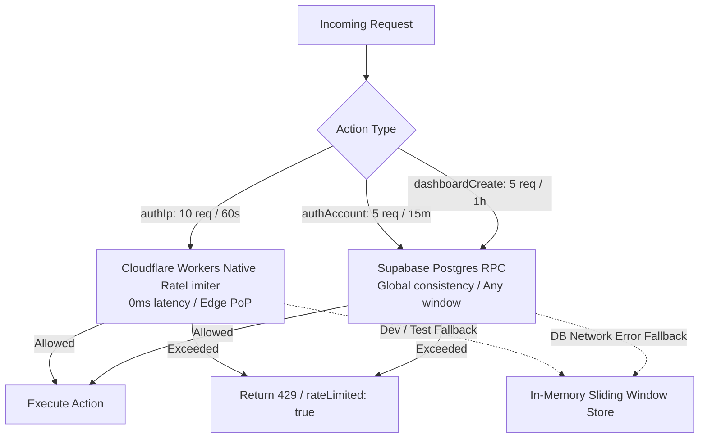

# Research: Upstash Redis Alternatives for Rate Limiting in Cloudflare + Supabase Stack

**Date**: 2026-08-27T18:14:00Z  
**Researcher**: Antigravity  
**Git Commit**: `74a01dbc4599376818ffc885586f6a467a3db320`  
**Branch**: `feature/s-02`  
**Repository**: `palucdev/scytala`  

## Research Question

Check what can be used instead of Upstash. Research alternatives using exa and context7, and present them in a comparison table. The priority is to avoid adding any external dependencies or cloud vendors, relying entirely on the existing **Cloudflare + Supabase** stack.

---

## Summary

In Scytala, Upstash Redis (`@upstash/ratelimit` and `@upstash/redis`) is currently used for 3 rate limiters in [`src/lib/rate-limit.ts`](../../../src/lib/rate-limit.ts):
1. `authIp`: 10 requests / 60 seconds per IP address (brute-force protection on [`src/actions/auth.ts`](../../../src/actions/auth.ts)).
2. `authAccount`: 5 requests / 900 seconds (15 min) per dashboard account identifier.
3. `dashboardCreate`: 5 requests / 3600 seconds (1 hour) per IP address ([`src/actions/dashboard.ts`](../../../src/actions/dashboard.ts)).

Upstash introduces an external third-party service, extra API credentials (`UPSTASH_REDIS_REST_URL`, `UPSTASH_REDIS_REST_TOKEN`), external HTTP request latency on every throttled call, and additional npm dependencies.

By leveraging the native capabilities of the existing **Cloudflare Workers** runtime and **Supabase PostgreSQL** database, Upstash can be completely replaced with **0 external dependencies** and **$0 added cost**.

The two primary zero-dependency replacements within our existing stack are:
1. **Cloudflare Workers Native Rate Limiting API (`ratelimits` binding in `wrangler.jsonc`)**: Built directly into Wrangler/Workers runtime. Zero network latency (evaluated in-memory at the Cloudflare edge PoP) and zero npm packages. Ideal for short-window IP throttling (`authIp`).
2. **Supabase PostgreSQL RPC Function (Atomic Token Bucket / Sliding Window)**: Built on the existing `@supabase/supabase-js` client and Postgres database. Globally unified across all edge regions and supports arbitrary time windows (e.g. 15 minutes, 1 hour). Ideal for longer-window throttling (`authAccount`, `dashboardCreate`).

---

## Comparison Table: Alternatives to Upstash

| Alternative | Technology & Tier | Extra NPM Packages | Added Network Latency | Consistency Scope | Window Flexibility | Operational Complexity | Free Tier Fit |
| :--- | :--- | :---: | :---: | :---: | :---: | :---: | :---: |
| **Current: Upstash Redis** | Upstash Serverless REST | `@upstash/ratelimit`<br>`@upstash/redis` | ~20–60 ms (HTTP to Upstash) | Global Redis Cluster | High (arbitrary sliding window) | Medium (extra vendor & API keys) | 10k commands/day free |
| **1. Cloudflare Workers Native Rate Limiting** | Cloudflare Workers binding (`wrangler.jsonc`) | **0 (None)** | **0 ms** (local isolate / PoP memory) | Edge PoP Local (Per Cloudflare location) | 10s or 60s standard windows | Low (declarative config in `wrangler.jsonc`) | **100% Free** (included in Workers) |
| **2. Supabase Postgres Atomic RPC** | Supabase Postgres Function (`supabase.rpc`) | **0 (Uses `@supabase/supabase-js`)** | ~15–40 ms (same as DB query) | **Strong Global Consistency** | **Any** (seconds, minutes, hours, days) | Low (1 SQL migration + RPC helper) | **100% Free** (included in Supabase DB) |
| **3. Cloudflare Workers KV** | Cloudflare KV namespace (`env.RATE_LIMIT_KV`) | **0 (Native Binding)** | ~5–15 ms (Edge KV read/write) | Eventually consistent (~60s global sync) | Medium (TTL-based) | Low (binding in `wrangler.jsonc`) | ⚠️ Free tier limited to 1k writes/day |
| **4. Cloudflare Durable Objects** | Cloudflare DO Actor / SQLite | **0 (Native Binding)** | ~10–50 ms (cross-region DO hop) | Strong Global Consistency | High (arbitrary in-memory logic) | High (requires DO class, migrations, config) | 100k requests/day free |
| **5. Enhanced In-Memory Store** | V8 Isolate Memory (Pure TypeScript) | **0 (None)** | **0 ms** (Process memory) | Single Isolate only (ephemeral) | High (in-memory sliding window) | Minimal (already in codebase fallback) | 100% Free |
| **6. Cloudflare WAF Rate Limiting** | Cloudflare Edge CDN WAF Rules | **0 (None)** | **0 ms** (blocked at CDN edge before Worker) | Global Edge CDN | Fixed windows (10s to 1 hour) | Zero code (configured in Cloudflare Dashboard) | 1 free rule per domain |

---

## Detailed Findings

### 1. Cloudflare Workers Native Rate Limiting Binding (`ratelimits`)

Cloudflare Workers provides a native Rate Limiting API (stabilized and generally available in Wrangler $\ge$ 4.36.0; Scytala is running Wrangler 4.123.0).

#### Architecture & Configuration
Declared directly in [`wrangler.jsonc`](../../../wrangler.jsonc):
```jsonc
{
  "name": "scytala",
  "main": ".open-next/worker.js",
  "compatibility_date": "2025-08-16",
  "compatibility_flags": ["nodejs_compat"],
  "ratelimits": [
    {
      "name": "AUTH_IP_LIMITER",
      "namespace_id": "1001",
      "simple": {
        "limit": 10,
        "period": 60
      }
    }
  ]
}
```

#### Access via OpenNext Cloudflare
In Next.js Server Actions and Route Handlers, bindings are retrieved synchronously via `@opennextjs/cloudflare`:
```typescript
import { getCloudflareContext } from "@opennextjs/cloudflare";

const { env } = getCloudflareContext();
const { success } = await env.AUTH_IP_LIMITER.limit({ key: clientIp });
if (!success) {
  return { error: "Too many requests. Please try again later.", rateLimited: true };
}
```

#### Advantages
- **Zero Latency**: Evaluated on the same machine running the isolate at the local Cloudflare Point of Presence (PoP).
- **Zero Dependencies**: Native to Cloudflare Workers runtime.
- **Local Dev Support**: Miniflare simulates rate limit counters automatically during `npm run dev` and `opennextjs-cloudflare preview`.

#### Constraints
- **Per-PoP Scope**: Counters are tracked per Cloudflare edge location (PoP) rather than a single global serialized counter. For abuse and brute-force prevention (`authIp`), this is completely acceptable.
- **Window Durations**: The `simple` configuration in Wrangler strictly accepts periods of `10` or `60` seconds. For 15-minute (`authAccount`) or 1-hour (`dashboardCreate`) windows, a database-backed or KV-backed approach is better suited.

---

### 2. Supabase PostgreSQL Atomic RPC (Token Bucket / Sliding Window)

Because Scytala already uses Supabase for authentication and dashboard data, we can execute rate limiting directly inside PostgreSQL with an atomic SQL function called via `@supabase/supabase-js`.

#### Architecture & SQL Implementation
A single table with atomic token-bucket calculation prevents concurrency race conditions without manual locks:

```sql
-- Migration: create rate_limits table and atomic RPC
CREATE TABLE IF NOT EXISTS public.rate_limits (
  key TEXT PRIMARY KEY,
  tokens DOUBLE PRECISION NOT NULL,
  last_refill TIMESTAMPTZ NOT NULL DEFAULT NOW()
);

-- Enable RLS and restrict to service_role
ALTER TABLE public.rate_limits ENABLE ROW LEVEL SECURITY;
REVOKE ALL ON public.rate_limits FROM PUBLIC, anon, authenticated;
GRANT ALL ON public.rate_limits TO service_role;

-- Atomic Token Bucket function with lazy refill
CREATE OR REPLACE FUNCTION public.check_rate_limit(
  p_key TEXT,
  p_max_tokens DOUBLE PRECISION,
  p_refill_rate DOUBLE PRECISION -- tokens added per second
)
RETURNS JSONB
LANGUAGE plpgsql
SECURITY DEFINER
SET search_path = public
AS $$
DECLARE
  v_now TIMESTAMPTZ := clock_timestamp();
  v_row public.rate_limits%ROWTYPE;
  v_new_tokens DOUBLE PRECISION;
  v_allowed BOOLEAN;
  v_retry_after INT := 0;
BEGIN
  -- Insert or fetch current token state
  INSERT INTO public.rate_limits (key, tokens, last_refill)
  VALUES (p_key, p_max_tokens - 1, v_now)
  ON CONFLICT (key) DO UPDATE
  SET
    tokens = LEAST(
      p_max_tokens,
      rate_limits.tokens + EXTRACT(EPOCH FROM (v_now - rate_limits.last_refill)) * p_refill_rate
    ),
    last_refill = v_now
  RETURNING * INTO v_row;

  IF v_row.tokens >= 1 THEN
    -- Consume token
    UPDATE public.rate_limits
    SET tokens = tokens - 1
    WHERE key = p_key;
    v_allowed := TRUE;
  ELSE
    v_allowed := FALSE;
    v_retry_after := CEIL((1.0 - v_row.tokens) / p_refill_rate)::INT;
  END IF;

  RETURN jsonb_build_object(
    'success', v_allowed,
    'remaining', FLOOR(GREATEST(0, v_row.tokens))::INT,
    'retryAfterSeconds', v_retry_after
  );
END;
$$;
```

#### Calling from TypeScript Helper
```typescript
import { createServerClient } from "@/lib/supabase";

export async function checkDbRateLimit(
  limiterType: "authAccount" | "dashboardCreate",
  identifier: string,
  maxTokens: number,
  refillRatePerSec: number
): Promise<{ success: boolean; retryAfterSeconds: number }> {
  const supabase = createServerClient();
  const { data, error } = await supabase.rpc("check_rate_limit", {
    p_key: `${limiterType}:${identifier}`,
    p_max_tokens: maxTokens,
    p_refill_rate: refillRatePerSec,
  });

  if (error || !data) {
    // Graceful fallback to in-memory store
    return inMemoryStore.limit(`${limiterType}:${identifier}`, maxTokens, 60000);
  }

  return {
    success: data.success,
    retryAfterSeconds: data.retryAfterSeconds ?? 0,
  };
}
```

#### Advantages
- **Zero New Dependencies**: Uses standard `@supabase/supabase-js`.
- **Global Consistency**: Enforced globally across all Cloudflare edge regions.
- **Arbitrary Time Windows**: Seamlessly handles 15-minute, 1-hour, or multi-day limits.
- **Low Database Footprint**: Table contains 1 row per active key; old keys can be purged with a simple `DELETE WHERE last_refill < NOW() - INTERVAL '1 day'`.

---

### 3. Cloudflare Workers KV

Cloudflare KV allows storing key-value pairs with automatic time-to-live (TTL).

#### Mechanism
- Set counter key: `await env.RATE_LIMIT_KV.put(key, count.toString(), { expirationTtl: windowSeconds })`.
- Check count: `const val = await env.RATE_LIMIT_KV.get(key)`.

#### Evaluation for Scytala
- **Drawback on Free Plan**: Cloudflare Workers Free plan allows only **1,000 KV writes/day** (though 100,000 reads/day). For active authentication and rate limiting, 1,000 writes/day can easily be exceeded during peak traffic or brute-force floods.
- **Verdict**: Not recommended on the Free tier when native Rate Limiting bindings and Supabase RPC are available.

---

### 4. Cloudflare Durable Objects (DO)

Durable Objects provide strongly consistent, in-memory state with SQLite persistence at the edge.

#### Evaluation for Scytala
- **Pros**: Unmatched consistency and performance at the edge.
- **Cons**: High implementation complexity (requires separate DO class files, namespace routing, and storage migrations). Overkill for an MVP with low concurrent user volume.

---

### 5. Enhanced In-Memory Store (Current Fallback)

The codebase already contains [`InMemorySlidingWindowStore`](../../../src/lib/rate-limit.ts#L10-L49).

#### Evaluation for Scytala
- In local development and unit tests (`npm run test`), the in-memory store is fast, reliable, and requires zero external connections.
- In production on Cloudflare Workers, each isolate instance keeps its own memory. For low-traffic MVPs, this acts as a light layer of defense, but active attackers hitting different PoPs or isolates get separate limits.

---

## Recommended Architecture for Scytala

To achieve **zero external dependencies**, **$0 additional cost**, and **maximal resilience**, Scytala should adopt a **Two-Tier Strategy**:



### Key Recommendations
1. **Remove Upstash**:
   - Uninstall `@upstash/ratelimit` and `@upstash/redis` from [`package.json`](../../../package.json).
   - Remove `UPSTASH_REDIS_REST_URL` and `UPSTASH_REDIS_REST_TOKEN` from [`.env.example`](../../../.env.example).
2. **Configure Cloudflare Native Limiter for IP Throttling**:
   - Add `"ratelimits"` binding in [`wrangler.jsonc`](../../../wrangler.jsonc) for `authIp` (10 req / 60s).
3. **Use Supabase RPC for Account & Resource Throttling**:
   - Add a lightweight `check_rate_limit` function in Supabase for `authAccount` (15m window) and `dashboardCreate` (1h window).
4. **Keep `inMemoryStore` as Universal Fallback**:
   - Retain [`InMemorySlidingWindowStore`](../../../src/lib/rate-limit.ts) for unit tests (`vitest`) and local `next dev` environments when Cloudflare bindings or remote database connections are unavailable.

---

## Code References

- [`src/lib/rate-limit.ts:1-196`](../../../src/lib/rate-limit.ts#L1-L196) - Existing Upstash Redis integration and in-memory fallback.
- [`src/__tests__/lib/rate-limit.test.ts:1-274`](../../../src/__tests__/lib/rate-limit.test.ts#L1-L274) - Vitest test suite testing in-memory store and Upstash fallback.
- [`src/actions/auth.ts:58,74`](../../../src/actions/auth.ts#L58) - IP and Account rate limit checks during authentication.
- [`src/actions/dashboard.ts:55`](../../../src/actions/dashboard.ts#L55) - Dashboard creation rate limiting check.
- [`wrangler.jsonc:1-23`](../../../wrangler.jsonc#L1-L23) - Cloudflare Workers deployment configuration.
- [`package.json:25-26`](../../../package.json#L25-L26) - Current Upstash dependencies.

---

## Architecture Insights

1. **Edge Locality vs Database Consistency**:
   - Short-window IP rate limiting (60s) is inherently transient and is best handled at the edge with Cloudflare's native binding to avoid putting unnecessary load on PostgreSQL.
   - Long-window quota enforcement (15 min, 1 hour, or daily quotas) needs durability and cross-region consistency, which Postgres handles with minimal overhead via atomic upsert (`ON CONFLICT DO UPDATE`).
2. **Zero Dependency Footprint**:
   - Removing `@upstash/ratelimit` and `@upstash/redis` reduces bundle size and eliminates third-party HTTP latency and potential outage vectors.
3. **Environment Parity**:
   - Using Miniflare's local rate limiting simulator and Supabase local CLI (`supabase start` / `npm run db:reset`) ensures complete dev/test parity with production.

---

## Historical Context (from prior changes)

- [`context/foundation/infrastructure.md`](../../foundation/infrastructure.md): Validated Cloudflare Workers as the 5/5 platform choice for Scytala due to first-class CLI automation, zero base costs, and native isolate primitives.
- [`context/foundation/tech-stack.md`](../../foundation/tech-stack.md): Established Next.js 16 + Cloudflare Workers + Supabase as the core tech stack.

---

## Related Research

- [`context/changes/dashboard-data-schema-and-auth-scaffold/research.md`](../dashboard-data-schema-and-auth-scaffold/research.md): Initial schema scaffold and rate limiting setup.

---

## Open Questions

1. **Migration Timing**: Should we implement the Supabase Postgres RPC migration first, or migrate IP rate limiting to Cloudflare Workers `ratelimits` binding simultaneously?
2. **WAF Custom Rules**: Would configuring 1 free Cloudflare WAF rate limiting rule at the DNS zone level be desired for additional DDoS protection in front of the Worker?
